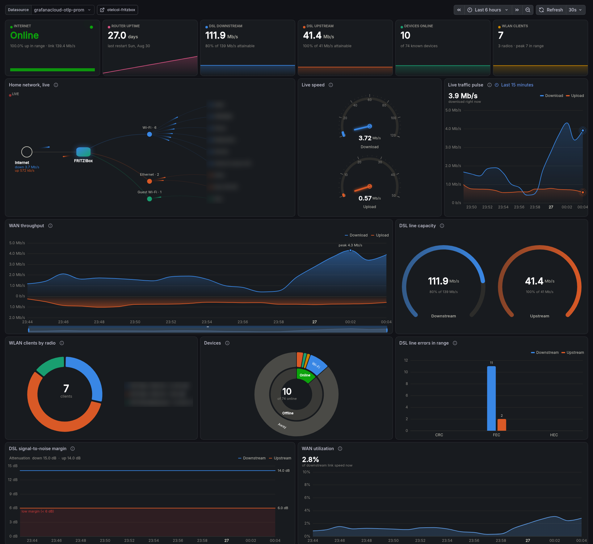

# Grafana dashboards



`dashboard/fritzbox-modern.json` is the dashboard above: KPI cards, a live
home network map, speed gauges, WAN traffic, DSL line quality, WLAN and
device breakdowns. It needs the
[Business Charts](https://grafana.com/grafana/plugins/volkovlabs-echarts-panel/)
panel plugin (7.x). The network map, device and table panels use the opt-in
`fritzbox.hosts.info` and `fritzbox.hosts.active` metrics. Import via
*Dashboards → New → Import* and pick your Prometheus datasource in the
dashboard's datasource selector.

`dashboard/fritzbox-network.json` is a simpler dashboard with core panels
only. Import it the same way, or manage it as code with
[gcx](https://github.com/grafana/gcx):

```sh
gcx dashboards create --context <your-context> -f dashboard/fritzbox-network-k8s.json
```

The dashboard queries Prometheus-style names — Grafana Cloud converts OTLP
metric names on ingestion (dots become underscores, units become suffixes):
`fritzbox.device.uptime` → `fritzbox_device_uptime_seconds`.
